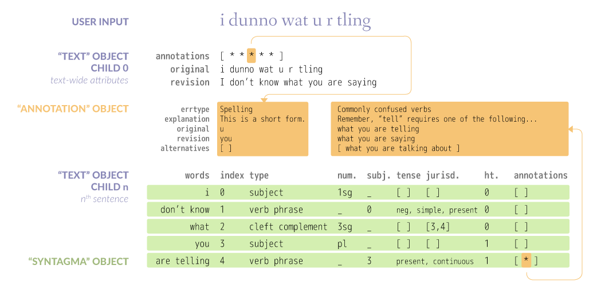
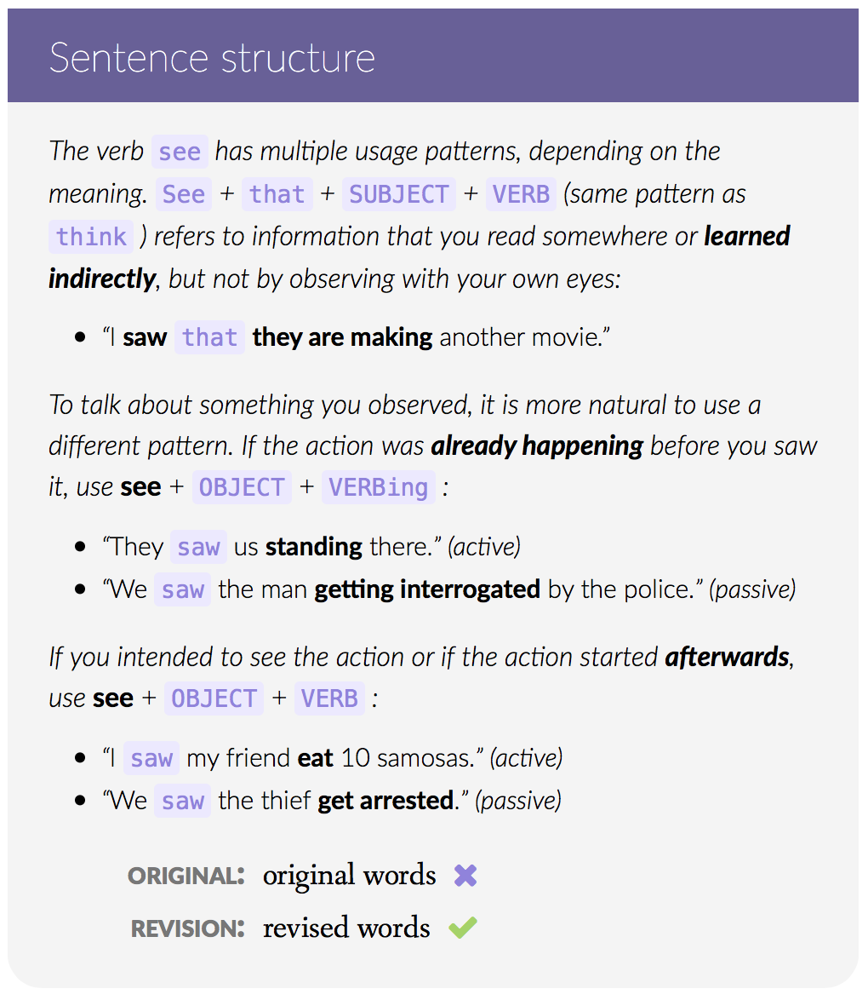

# Claire

The English tutor of the future. Or, in more programmer-y terms, a thorough linter for non-native conversational English.

<http://learnengli.sh/>

The actual program is written in Python with a Flask API. This repo contains the web app, which is accessible at .... It is intended to show a working example of the API in action.

Most of this space will be devoted to the API documentation. The API is public, so it is not necessary to run a local copy of this web interface in order to use it. The code in ```app/index.jade``` and ```js/claire.app.js``` should help to “Clair-ify” unclear points.

## Running the website locally

The front-end was intended to be as simple as possible – no build tools required.

1. Clone this repo
2. Run `python -m SimpleHTTPServer` (If you experience strange behavior, you might want to use Node’s `http-server`, MAMP or WAMP.)
3. Go to <http://localhost:8000>

You may notice that certain things have been done “the old-fashioned way”. In the interest of keeping it simple, this project does **not** use jQuery, Node.js, or Webpack.

*(Note to self: The Markdown texts have not been included in this repo. Atom requires a Markdown parser to compile included Markdown files inside Jade files. Run the following command inside the folder to enable compilation if necessary.)*

`npm install marked --save`

Also, ```/index.html``` is the site’s landing page. The app itself is at ```app/index.html```. Old-school routing.

### Demo mode

To facilitate development, you can long-press (or long-click) anywhere on ```app/index.html``` to toggle demo mode, which contains a set of pre-parsed sentences. This allows you to avoid sending unnecessary requests to the API server.

### Fonts

In the production version, there is a `/fonts` folder, which contains some heavily optimized versions of the non-Latin fonts for the help section. Since it is not related to the functionality of the API, it has been excluded from this repo intentionally, so don’t worry if your browser barks at you.

## Sending your request

Send the following AJAX request in the following form:

```javascript
url: "//learnengli.sh:8686",
type: "GET",
data: { text: "I am a cool sentence. I am another cool sentence." }
```

If you encounter problems with special or accented characters, you need to URI-decode the user input string (`decodeURIComponent(userInput)`).

If your **GET** request also initiates a dead-end **OPTIONS** request, Claire returns the text string `IGNORE_REQUEST` when it receives the **OPTIONS** request. If you receive this string, don't do anything.

Note that [vue-resource](https://github.com/vuejs/vue-resource) avoids these issues from the get-go, but jQuery does not. I’m not sure about other JavaScript AJAX libraries.

Then comes the response. Hopefully it's JSON. If it's not, it is one of the following strings:

- `CLAIRE_IS_SLEEPING`: The API server is temporarily down or restarting.
- `INPUT_TOO_LONG`: Input strings of more than 1000 characters cause the Python CoreNLP wrapper to freeze mysteriously, so I have capped the input at 1000 for now.
- `INPUT_TOO_SHORT`: A minimum of 3 words is required. This reduces wasteful API calls and forces users (at least somewhat) to type meaningful sentences.
- `NOT_ENGLISH`: More non-Latin characters than Latin characters were detected in the input.
- `CLAIRE_BUG`: The sentence triggered a bug in Claire. Please do not file an issue on this repo; send it to [claire@culabs.org](mailto:claire@culabs.org).

## Claire JSON object

This graphic ([full size](images/api.png)) illustrates the data structure:

[](images/api.png)

Let's call Claire’s output a `text` object. This `text` object consists of 2 basic parts: **text-wide** information and **per-sentence** information.

*(This is necessary because some of the error detection happens before Claire splits the sentence into indexed chunks, and most of it happens afterward. Many of the early detections are done with regular expressions, and they cannot be cleanly tied to chunks that are indexed later in the pipeline.)*

### Text-wide information

`text[0]` is a dictionary that contains the text-wide information in four keys:

- `text[0]['original']` (string) is the original user input.

- `text[0]['revision']` (string) is the entire corrected text. If you just want the **final autocorrection** from Claire, this is the value to extract.

- `text[0]['annotations']` (array) is a collection of `Annotation` objects (explained below) that were generated during Claire's first pass – these are mostly spelling mistakes and fixed expressions that can be found without deep structural analysis.

- `text[0]['firstpass']` (string) is a string of HTML that has been “diffed” to show the changes between the original input and the first pass (not the final correction). Edited and added words are wrapped in `<span class="add">` and deleted words are wrapped in `<span class="del">`. Flagged (but not auto-corrected) chunks that are missing articles are wrapped in `<span class="no-article">`. This makes it possible to condense the presentation of first-pass spelling errors, which would be cumbersome if presented individually. You can do this by hiding all `Annotation`s whose explanation contains the words *spelling* and *typo*.

- `text[0]['allchanges']` (string) same as `firstpass` but this shows the difference between `original` and `revision`.

### Per-sentence information

`text[n]` contains information about the *nth* sentence of the text. If you type in one sentence, `text.length` is `2`. If you type in ten sentences, `text.length` is `11`.

`text[1]` represents sentence #1 and each child of `[text][1]` is a `Syntagma` object. A `Syntagma` is similar to what is called a "chunk" in NLP or "constituent" in linguistics, although the definition has been adapted a bit to fit the requirements of the Claire engine.

Some of the information may be more relevant to linguistics than apps, but they have been included just in case you want to use them.

### `Syntagma` object

#### Basic features

- `text[1][x]['index']` (int) is the 0-based position of the `Syntagma` – probably not necessary since the index can be queried in the language of the UI, but it's there anyway, just in case.

- `text[1][x]['words']` (string) represents the corrected words of a `Syntagma`.

- `text[1][x]['annotations']` (array) This contains all the `Annotation` objects for the `Syntagma`.

- `text[1][x]['afterspace']` (bool) This was left out of the screenshot. This is to ensure correct spacing in the UI. If you choose to present only `text[0]['revision']` (that is, the final corrected and concatenated string), you don't have to worry about this. But if you want to present the text chunk-by-chunk (as on the Claire site), this value is necessary. Basically, it is `true` for all `Syntagmas` that do not precede punctuation. So, in the sentence "I'm a teacher", there are three `Syntagmas`: `I`, `'m`, `a teacher`. In order to prevent the output from looking like "I 'm a teacher", the `afterspace` value of the first chunk is set to `false`. You can use a CSS class to set the spacing accordingly.

- `text[1][x]['tense']` (array) A list of attributes pertaining to the verb. Some of them are not tense words in the strict sense of the word. Possible values are among the following:  
  - **Temporal relation**: `past`, `present`, `future`, `going-to future`, `future in the past`
  - **Sub-category**: `simple`, `continuous`, `perfect`,
  - **Voice and modality**: `passive`, `modal`, `obligation`, `prohibition`, `no-obligation`
  - **Polarity**: `negative`, `question`  

#### Icing-on-the-cake features

- `text[1][x]['type']` *(string)* is the syntactic label. Some are basic, like "subject" and "object"; others are a bit more obscure or even invented (since there are many gray areas in the analysis of non-native language).

- `text[1][x]['number']` *(string)* is the grammatical number of the `Syntagma`. `1sg` (first-person singular, only for "am/was"), `3sg` (third-person singular), `pl` (plural), and blank are the four values. Verb phrases that must agree with their subjects have a `['number']` value, and so do noun phrases. All other `Syntagmas` have a blank value.

- `text[1][x]['subject']` *(int)* for finite verb phrases, this is the 0-based position of the verb's subject.

- `text[1][x]['object']` *(int)* for verb phrases, this is the 0-based position of the verb's direct object.

- `text[1][x]['multiplechoice']` *(bool)* Not all `Syntagma`s with errors are automatically corrected. Sometimes Claire can only give suggestions. These `Syntagmas` are given a `multiplechoice` attribute that allows you to easily style them differently than normal ones, if you wish.

- `text[1][x]['jurisdiction']` *(array)* This is an array of indexes that typically show some kind of modifying relationship. In the sentence *There are many people who like to go to the beach*, `many people` is at index `1` and governs `2` (*who*), `3` (*like*), `4` (*to go*) and `5` (*to the beach*).

- `text[1][x]['height']` *(int)* This number reflects how many modifying relationships the `Syntagma` belongs to. To see an extreme example of the `height` and `jurisdiction` values in action, try this sentence in Claire and notice the underlines (`height`) and orange highlights (`jurisdiction`): *I can't tell you how crazy the people I met thought I was.*

### `Annotation` object

- `…['annotations'][x]['original']` *(str)* The original text chunk that was detected as problematic.

- `…['annotations'][x]['errtype']` *(str)* General reason for the revision. Possible values include: Articles, verb phrase error, infinitives and gerunds, spelling, incomplete sentence. There are probably about 20 so far, but I have not made an exhaustive list.

- `…['annotations'][x]['explanation']` *(str)* Explanatory text relevant to that particular grammatical mistake. Sometimes they can be quite technical. **They are formatted in Markdown** (see note below), so you will need to parse them. In general, the more elementary the mistake (e.g. *I am go there*), the more difficult the explanation will be. At that level, it is hoped that the automatic corrections will become habitual for the learner without the need for complex explanations.

- `…['annotations'][x]['revision']` *(str)* Claire's automatic correction. Most of the time, there is 1 `revision` and 0 `alternatives`, but depending on the type of error, there could be a primary `revision` and 1 or more `alternatives`. For most article errors, the value of this key is `(dependent on context)`, but `alternatives` are generated.

- `…['annotations'][x]['alternatives']` *(array)* Array of strings that represent alternative corrections. Sometimes they may span a larger portion of the sentence than one `Syntagma` (for example, `I have very less books` generates the alternative `hardly have any books`, which spans the verb phrase and the object).

#### Regarding the formatting of ```Annotation``` explanations

Because the [use-mention distinction](https://en.wikipedia.org/wiki/Use–mention_distinction) really makes it tricky to write clear and concise explanations of someone’s grammatical errors, the ```Annotation``` explanations make use of **Markdown** for formatting. Some explanations are simple enough that no formatting was used. However, in general, they make extensive use of:

- **code blocks** (for word-mentions – very important)
- **lists** (and, infrequently, lists-inside-lists)
- **bold**
- **italic**
- **strikeout**

so make sure your parser can handle these adequately, even in slightly odd situations, such as blocks that consist of only one letter. This website uses the very simple and small [micromarkdown](https://github.com/SimonWaldherr/micromarkdown.js), with one [bugfix](https://github.com/SimonWaldherr/micromarkdown.js/issues/22#issuecomment-221808600)).

For reference, here is one of the most complex explanations (most of them are not this complex). *(Note that the site uses italic as the default, so the text that is actually marked italic in code is displayed upright here.)*

[](images/annotation.png)

## Acknowledgements

* [Stanford CoreNLP](http://stanfordnlp.github.io/CoreNLP/) is available under the [GNU General Public License v3+](http://www.gnu.org/licenses/gpl.html).  
* [Stanford CoreNLP](http://stanfordnlp.github.io/CoreNLP/) © 2009-2016 The Board of Trustees of The Leland Stanford Junior University.  
* [NLTK](http://www.nltk.org/) is available under the [Apache 2.0 License](http://www.apache.org/licenses/LICENSE-2.0).  
* [Wordnet®](http://wordnet.princeton.edu/) © 2016 The Trustees of Princeton University.  
* [Wordnet®](http://wordnet.princeton.edu/) is available under the [Wordnet 3.0 License](http://wordnet.princeton.edu/wordnet/license).  
* [Pattern](http://www.clips.ua.ac.be/pages/pattern) is available under the [BSD license](http://www.linfo.org/bsdlicense.html).  
* Some of the data files used to develop Claire are derived from the *Google Web Trillion Word Corpus*, as described by [Thorsten Brants and Alex Franz](http://googleresearch.blogspot.com/2006/08/all-our-n-gram-are-belong-to-you.html), and distributed by the [Linguistic Data Consortium](http://www.ldc.upenn.edu/Catalog/CatalogEntry.jsp?catalogId=LDC2006T13). Subsets of this corpus distributed by [Peter Norvig](http://norvig.com/ngrams/). Corpus editing and cleanup by Josh Kaufman.
